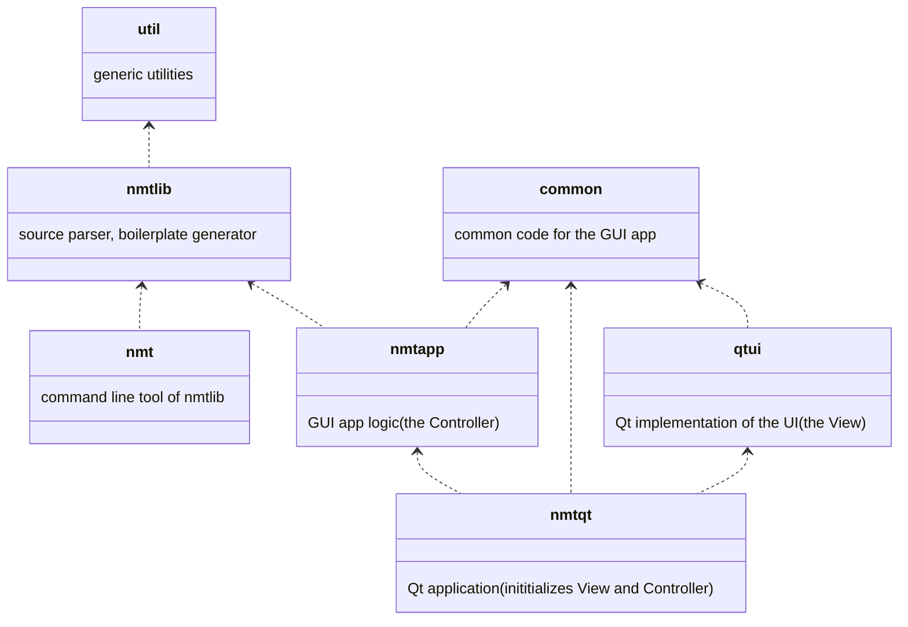

# NMT

No more tears caused by writing the `#include` boilerplate, organizing C++ code into files, slow compile times or spooky C++ error messages at a distance.

This is an experimental C++ developer tool with the goal of making C++ development a smoother experience.

## Why we need this

When we're constructing C++ programs our mental model consists of language-level concepts, like namespaces, classes, functions, type aliases. Those *language entities* should be first-class citizens in a C++ IDE. The IDE should provide an easy way to create and manipulate them. It should be aware about the relations between them.

On the other hand, organizing the language entities into files should be done automatically by the IDE:

- During development it's best to use the highest granularity: each language entity should go into a separate file which minimizes the amount of code that needs to be recompiled after a change. Also, compiler errors can be isolated much better. The IDE can even use heuristics for a dynamically changing precompiled header set.
- For CI builds it's best to use unity builds which can be reliably constructed automatically if dependency relations between language entities are known and continuously enforced by the IDE.

## Objectives

We're aiming for the following goals and benefits:

- No need to manually manage #include files
- Smoother, "one-click" developer experience: no need to deal with files (cpp/h): C++ languages entities are created "into the project", no need to make decisions about grouping and organizing them into source headers
- No need to duplicate function declarations (cpp + h)
- Faster builds during development - because we're rebuilding only what has been modified, in the strictest sense: development builds compile each atomic C++ language entity in a separate file
- Faster builds in CI using unity builds.
- More reasonable compiler error messages during development since all language entities are first compiled in isolation before compiling other entities which use them. Unlike in traditional builds where compiling a cpp file might fail because of errors in their headers and the interactions between them.
- Full compatibility with existing projects: they can be gradually converted or extended with nmt-style modules

The best way to achieve these goals would be storing the C++ code in a database of language entities, preferably in AST. But this project is a POC experiment, we're trying to achieve many of the benefits of the ideal solution but with minimal effort (no AST, for example). It looks like this:

- We store (almost) each C++ language entity in a separate .h file. These files don't contain `#include` directives or namespace definitions. Instead, the dependencies, namespaces, visibility should be specified with special annotations in C++ comments, for example:

**`<src>/Foo.h`:**
```c++
// #fn
SomeClass Foo(BarFactory& bf) { ... }
// #needs: SomeClass, BarFactory*
// #defneeds: <string>, "non-nmt-header.h", BarFactory
// #visibility: public
// #namespace: foo::bar
```

- we will call the `run_nmt` CMake utility function from the corresponding target's CMake script:

**`<src>/CMakeLists.txt`:**
```cmake
add_executable(MyTarget ${sources})
run_nmt(MyTarget FILES ${sources})
```

- the `run_nmt` function reads `src/Foo.h`, runs the `nmt` tool to generate the corresponding .h and .cpp files into the build directory and adds the sources to the cmake target. It also adds a pre-build step which keeps the project up to date. The generated files in this case:

**`<build>/generated/nmt/public/Foo.h`**:

```c++
#pragma once
#include "<build>/generated/nmt/public/SomeClass.h"
class BarFactory;
```

**`<build>/generated/nmt/private/Foo.cpp`**:

```c++
#include "<build>/generated/nmt/public/Foo.h"
#include "<build>/generated/nmt/public/BarFactory.h"
#include "non-nmt-header.h"
#include <string>
#include "<src>/Foo.h"
```

- A GUI app helps creating and managing the language entities and writing the annotations.

## Development status

The `nmt` command-line tool is working: it parses the source files and creates the boilerplate headers and cpp files.

The development of the GUI tool has just started. We're dogfooding the `nmt` tool by writing most of the GUI app in nmt-style single-language-entity headers.

## Targets

`nmt` and `nmtqt` are executables, the other modules are static libraries. The arrows mean *uses*.


